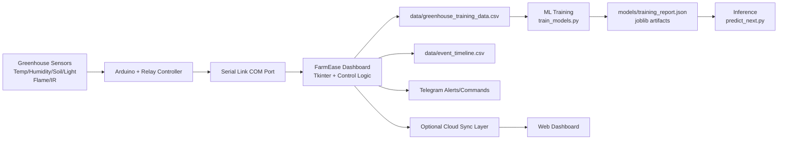

# FarmEase Architecture (Event Slide)

Use the Mermaid diagram below directly in your slide or markdown renderer.

Standalone Mermaid source files:
- `docs/diagrams/system_architecture.mermaid.js`
- `docs/diagrams/event_demo_sequence.mermaid.js`
- `docs/diagrams/fallback_control_flow.mermaid.js`

## Talk track (30 seconds)
- Sensors and relays stay on local hardware for deterministic control.
- Dashboard is the real-time decision hub (alerts, commands, logging).
- ML artifacts are retrained from collected telemetry and used for predictions.
- Cloud/web is optional and additive; local operation is independent of internet.

## Connectivity decision note
- Current prototype hardware does not include an onboard Wi-Fi module.
- Because connectivity is serial-to-laptop, direct device-to-cloud sync is redundant for this event build.
- Chosen approach: local-first control and logging on the dashboard, with Telegram used for remote alerts/commands.
- Cloud sync remains a future enhancement path once dedicated network hardware is added.
- Presenter script wording is mirrored in `docs/EVENT_DEMO_SCRIPT.md` under "Connectivity statement (say this explicitly)".

## If Wi-Fi module is added (future approach)
- Add secure MQTT/HTTPS publish from controller path to a cloud telemetry endpoint.
- Keep local dashboard and serial control as the safety-critical primary path.
- Add cloud command queue with local safety gate before relay execution.
- Use cloud dashboard for remote trends/history while preserving offline local operation.
